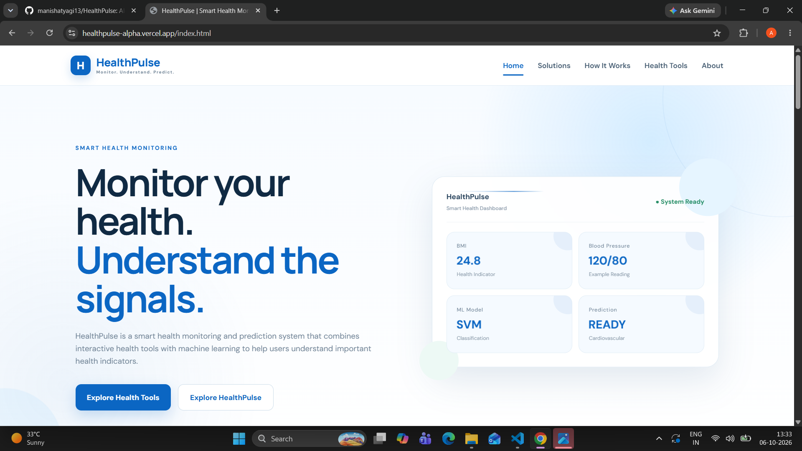
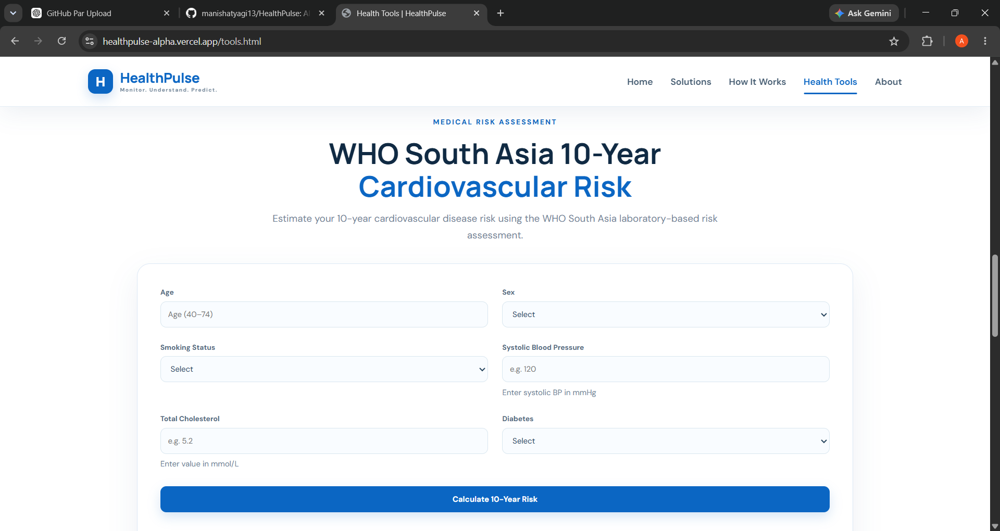
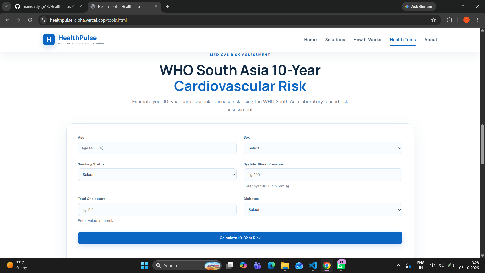
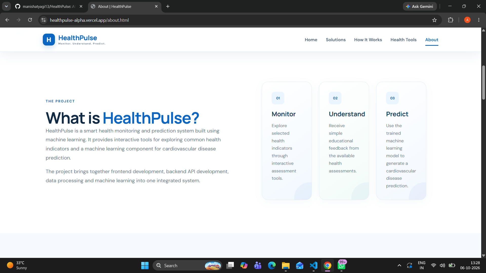

# 🩺 HealthPulse – AI-Powered Health Risk Prediction System

HealthPulse is an AI-powered health risk prediction system designed to analyze health-related data and predict potential health risks using Machine Learning. The project provides a simple web-based interface where health information can be processed and evaluated through trained machine learning models.

## 🚀 Features

- 🩺 AI-based health risk prediction
- 🤖 Machine Learning model for health-risk classification
- 📊 Health data analysis and preprocessing
- 🌐 User-friendly web interface
- ⚙️ Backend API for prediction and data processing
- 🗄️ Database integration
- 📁 Health-related datasets for training and testing
- 🔍 WHO-based health risk data integration
- 📈 Model evaluation and prediction

## 🛠️ Technologies Used

- Python
- HTML
- CSS
- JavaScript
- Pandas
- NumPy
- Scikit-learn
- FastAPI
- SQLAlchemy
- Pydantic
- SQLite
- Git & GitHub

## 📂 Project Structure

    HealthPulse/
    │
    ├── assets/
    │   └── images/
    │
    ├── backend/
    │   ├── __init__.py
    │   ├── database.py
    │   ├── main.py
    │   ├── models.py
    │   ├── schemas.py
    │   └── who_risk.py
    │
    ├── data/
    │   ├── cardio_cleaned.csv
    │   ├── cardio_train.csv
    │   └── who_south_asia_risk.csv
    │
    ├── frontend/
    │   ├── css/
    │   ├── js/
    │   ├── about.html
    │   └── how-it-works.html
    │
    ├── .gitignore
    ├── requirements.txt
    └── README.md

## ⚙️ Installation

### 1. Clone the Repository

    git clone https://github.com/manishatyagi13/HealthPulse.git

### 2. Open the Project

    cd HealthPulse

### 3. Create a Virtual Environment

    python -m venv .venv

### 4. Activate Virtual Environment

For Windows:

    .venv\Scripts\activate

For Linux/macOS:

    source .venv/bin/activate

### 5. Install Required Libraries

    pip install -r requirements.txt

## ▶️ Run the Project

Start the backend using:

    uvicorn backend.main:app --reload

Then open the application in your browser:

    http://127.0.0.1:8000

## 🧠 Machine Learning Workflow

    Health Data
          ↓
    Data Collection
          ↓
    Data Cleaning
          ↓
    Data Preprocessing
          ↓
    Feature Selection
          ↓
    Model Training
          ↓
    Model Evaluation
          ↓
    Health Risk Prediction
          ↓
    Prediction Result

## 📊 Dataset

HealthPulse uses health-related datasets for training and evaluating the machine learning model.

The project includes:

- Cardiovascular disease dataset
- Cleaned cardiovascular dataset
- WHO South Asia health risk dataset

## 🎯 Project Objectives

- Develop an AI-based health risk prediction system.
- Analyze health-related data using Machine Learning.
- Identify potential health risks from user information.
- Provide quick and understandable prediction results.
- Build a simple and user-friendly healthcare technology platform.
- Demonstrate the practical application of Data Science and Machine Learning in healthcare.

## 📸 Screenshots

### 🏠 Home Page

### 📊 Dashboard

### 🩺 Health Risk Prediction

### ℹ️ About Page

## 🔮 Future Scope

- Integration of larger and more diverse health datasets.
- Deep Learning-based prediction.
- Real-time health monitoring.
- Wearable device integration.
- Personalized health recommendations.
- Mobile application development.
- Cloud deployment.
- Advanced health data visualization.
- Improved prediction accuracy.

## ⚠️ Disclaimer

HealthPulse is developed for educational and research purposes only. The predictions generated by this system should not be considered a medical diagnosis or a replacement for professional medical advice. Users should consult a qualified healthcare professional for medical decisions.

## 👩‍💻 Developer

**Manisha Tyagi**

B.Tech – Data Science

GitHub: https://github.com/manishatyagi13

## ⭐ Acknowledgement

This project was developed as an academic project to explore the practical application of Machine Learning, Data Science, and Web Technologies in the healthcare domain.

## 📜 License

This project is intended for educational and research purposes.